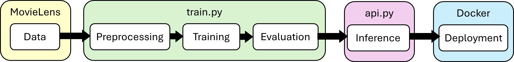
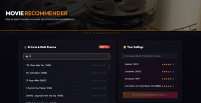
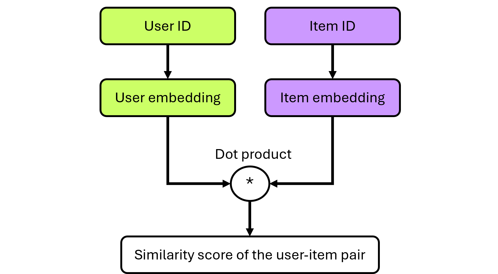

# Introduction
This movie recommender is an application that uses machine learning of movie rating data to offer personalized movie recommendations. It can be automatically deployed with Docker. 

Architecture of the movie recommender app:



# Table of Contents
- 🥽[App demo](#app-demo)
- 📗[Data source](#data-source)
- 💡[Methodology](#methodology)
- 🔨[Installation](#installation)
- 📁[Project structure](#project-structure)
- 📞[API](#api)
- 💻[How to use the movie recommender](#how-to-use-the-movie-recommender)
- 📈[Analysis of model performance](#analysis-of-model-performance)
- 🔮[Future work](#future-work)
- 🏅[Acknowledgements](#acknowledgements)

# App demo


# Data source
The MovieLens 100K dataset released in April 1998 was used to train the demo model. 

# Methodology
- **Random negative sampling:** For every user, positive samples are movies that the user has interacted with positively, defined as a rating of at least 3 (out of a total of 5). Negative samples consist of movies with a rating smaller than 3, movies that are unknown to the user, and movies that the user chose not to watch. Negative samples of each user are randomly chosen from the entire training set and used together with positive samples to train the model. This allows the model to more accurately classify positive and negative predictions (recommendations), which improves the robustness of the model compared to purely positive sampling.

- **Batching:** At every training epoch, the model is fed batches of samples and undergoes training batch-by-batch until the entire training set has been input into the model. At the end of a training epoch, the trained PyTorch tensors are collated together by the `torch.utils.data.DataLoader.default_collate()` function. Having a batch size that is too small can result in unstable predictions and prevent convergence, but training the model on the entire training set in one go requires very large random-access memory. An appropriate batch size has to be chosen for efficient and low-memory model training. The default batch size in this project is 256. 

- **Model - Two-Tower neural network:** The Two-Tower model consists of a user tower and a item (movie) tower. Each tower processes each of their respective features (ie. user and movie IDs) into vectors, known as embeddings, and outputs these embeddings. The similarity score is computed for each user-item pair by taking the dot product of the user embeddings and item embeddings. The model outputs the sum of the similarity scores of all user-item pairs. Embeddings are initialized with small random weights. During training, the loss function calculates the loss from the similarity scores and the optimizer adjusts the weights to optimize the similarity score of each user-item pair towards their true targets (ie. positive or negative interaction).




- **Loss function - Binary cross-entropy (BCE):** Measures the deviation of the model's predicted similarity scores from the true targets. The targets are `1.0` = positive interaction/liked the movie and `0.0` = negative interaction/disliked the movie. A lower BCE loss signals better predictive accuracy of the model. A positive interaction with a low similarity score, or a negative interaction with a high similarity score, will both give a large loss. 

- **Optimizer - Adaptive moment estimation (Adam):** Modifies the weights in the weight matrices of each tower's embeddings to minimize the loss function. 

- **Early stopping:** If a model is trained over too many epochs, it will be overfitted to the training set and make poor predictions on new data. This project halts the model training once the validation loss stops improving for a certain number of consecutive epochs. 

- **FastAPI:** The interface for the Movie Recommender app to pull trained embedding weights and other metadata that have been saved into the folder `artifacts/`. 

- **Inference - "Cold start" for new users:** New users looking for movie recommendations on the app would not have been in the original dataset. It would be time-consuming to add the data from new users and retrain the whole model. Therefore, we implement a "cold start" to retrieve movie ratings data from the new users and make movie recommendations in real-time based on the new data and the trained model. The user embeddings of the new user are computed as the weighted average of the embeddings of the rated items. 

# Installation

### Prerequisites
- Python 3.11+
- pip package manager
- Docker (if not, you can follow the installation instructions in the [End-to-end execution](#end-to-end-execution) section instead)

### Quick deployment on Docker
1. Open a shell.
2. Clone the git repository.
```
git clone https://github.com/lim-li-xuan-phy/movie-recommender.git
```

3. Navigate to the downloaded repository and build the Docker image.
```
cd movie-recommender
docker build -t movie-recommender -f Deployment/Dockerfile .
```

4. Run the container
```
docker run -p 8000:8000 movie-recommender
```

5. Access the application at `http://localhost:8000/` on your browser.

### End-to-end execution
Refer to `demo.ipynb` for a demonstration of the end-to-end execution of the Movie Recommender app using the demo model. In the following instructions, we will go through the steps from downloading a dataset of your choice to deploying the movie recommender app.

While the demo model is trained on the MovieLens 100K dataset (100K ratings, 1.7K movies, and 1K users), this project is also compatible with the latest small and full MovieLens datasets. Since the full MovieLens dataset is substantially larger (33M ratings, 86K movies, and 300K users as of May 2026), it would take a much longer time to train the model. To try out training on this dataset, you can download the updated full dataset and sample a fraction of it when training the model. 

**1. Open a shell.**

**2. Clone the git repository**
```
git clone https://github.com/lim-li-xuan-phy/movie-recommender.git
cd movie-recommender
```

**3. Create virtual environment**
```
python -m venv venv
```

**4. Activate virtual environment**
```
# Windows
venv\Scripts\activate
# MacOS/Linux
source venv/bin/activate
```

**5. Install dependencies**
```
pip install -r Deployment/requirements.txt
cd src
```

**6. Update dataset**

If you want to use the 100K dataset, you can skip this step because the dataset is already in the folder `Dataset/ml-100k/`. 

Download the latest full MovieLens dataset, or update an existing latest full MovieLens dataset by running this command:
```
python update_data.py
```

Expected output: 
```
Downloading https://files.grouplens.org/datasets/movielens/ml-latest.zip to YourChosenLocation\Movie Recommender\Dataset\ml-latest.zip...
[==============================] 100.0% (334.6MB / 334.6MB)
Download complete.
Extracting YourChosenLocation\Movie Recommender\Dataset\ml-latest.zip...
Extraction complete.
Successfully updated dataset in the location: YourChosenLocation\Movie Recommender\Dataset\ml-latest
```

Add the `--small` flag to download the latest small MovieLens dataset instead. 
```
python update_data.py --small
```

**7. Model training**

Train the model on a dataset of your choice. Here, we use the latest full MovieLens dataset. The training loss, validation loss, and performance metrics at each epoch will be displayed.
```
python train.py --dataset ml-latest --sample-fraction 0.003
```

Example output:
```
Loading ml-latest dataset...
Sampling 0.30% of the dataset for faster training...
Dataset has 62224 users, 11142 movies, and 101496 ratings.
Using device: cpu
Pre-train metrics - Precision@10: 0.0001, Recall@10: 0.0005, NDCG@10: 0.0003
Starting training for 100 epochs...
Epoch 01/100 | Train Loss: 0.6928 | Val Loss: 0.6919 | Val Precision@10: 0.0005, Recall@10: 0.0051, NDCG@10: 0.0022
...
Epoch 28/100 | Train Loss: 0.5311 | Val Loss: 0.6206 | Val Precision@10: 0.0018, Recall@10: 0.0178, NDCG@10: 0.0084
Early stopping at epoch 28.
Trained model saved in YourChosenLocation\Movie Recommender\src\best_model.pt.
Final Test Metrics - Precision@10: 0.0018, Recall@10: 0.0174, NDCG@10: 0.0086
Saving artifacts...
All artifacts saved to YourChosenLocation\Movie Recommender\src\artifacts:
  idx_to_item.pkl  (245,019 bytes)
  item_embeddings.pt  (2,853,985 bytes)
  item_to_idx.pkl  (245,019 bytes)
  movie_id_to_title.pkl  (2,857,693 bytes)
Done! You can now run: uvicorn api:app --reload
```

Use the `-h` flag to view other available flags. You can configure the model training through these flags.
```
>> python train.py -h
...
  --dataset {ml-100k,ml-latest-small,ml-latest}
                        Dataset to train on. Default = ml-100k
  --epochs EPOCHS       Number of training epochs. Default = 30
  --patience PATIENCE   Early stopping patience. Default = 3
  --batch-size BATCH_SIZE
                        Batch size for training.
                        Default = 256
  --sample-fraction SAMPLE_FRACTION
                        Fraction of the dataset to use for training
                        (useful for large datasets). Default = 1.0
```

**8. Load app**

Run the Uvicorn web server.
```
uvicorn api:app --reload
```
Expected output:
```
INFO:     Will watch for changes in these directories: ['YourChosenLocation\\Movie Recommender\\src']
INFO:     Uvicorn running on http://127.0.0.1:8000 (Press CTRL+C to quit)
INFO:     Started reloader process [35548] using WatchFiles
INFO:     Started server process [8864]
INFO:     Waiting for application startup.
Loading artifacts...
  Loaded 11142 movies, embedding dim=64
API ready.
INFO:     Application startup complete.
```
Ctrl+click on the link given in the output. The app will appear in your browser. You can now rate the movies in the app and get your personalized recommendations! ヾ( ˃ᴗ˂ )◞ • *✰


# Project structure
```
movie-recommender/
│
├── README.md               # This file: introduction and installation
├── Demo/
│   ├── demo.ipynb          # Demonstration and analysis of model training
│   ├── best_model.pt       # Saved model from demo.ipynb trained on ml-100k dataset
│   ├── loss_curve.png      # Saved plot of training and validation losses from demo.ipynb
│   └── artifacts/                # Saved artifacts from demo.ipynb, ready for use in api.py for quick deployment
│       ├── idx_to_item.pkl       # Dictionary mapping movie IDs in the dataset to contiguous indices
│       ├── item_to_idx.pkl       # Dictionary mapping contiguous indices to movie IDs in the dataset
│       ├── movie_id_to_title.pkl # Dictionary mapping movie IDs to their movie titles
│       └── item_embeddings.pt    # Item embeddings from the trained two-tower model
│
├── Dataset/
│   ├── ml-100k/
│   │   ├── u.data        # Dataset used for training
│   │   └── u.item        # Data for mapping between movie IDs and movies
│
├── src/
│   ├── static/
│   │   ├── favicon.png       # Application favicon
│   │   ├── film-reel.jpg     # Application header image
│   │   └── index.html        # Application page HTML
│   │
│   ├── update_data.py    # Update ml-latest or ml-latest-small datasets
│   ├── classes.py        # Python classes for data parsing and setting up the Two-Tower model
│   ├── train.py          # Model training                 
│   └── api.py            # API for handling user requests on application
│
└── Deployment/
    ├── Dockerfile          # Script for automatic setup of dependencies to be run with Docker
    └── Requirements.txt    # Packages that will be automatically installed when Dockerfile is executed

```

# API
**Endpoints:**
```
GET / # Serves the app page UI
GET /favicon.ico # Serves the app favicon
GET /movies # Gets the list of movies available for new users to rate from saved artifacts
POST /recommend # Performs "cold-start" calculations on the new user's ratings and gives movie recommendations to new users
```

# How to use the movie recommender
1. Load the app on your browser at `http://localhost:8000/`.
2. Scroll through the list of movies and rate the movies you have watched before by clicking on the appropriate number of stars. Alternatively, you can enter their titles into the search bar.
3. The movie recommender requires you to rate at least 5 movies before giving its recommendations. Once you have rated 5 or more movies, click the "GET MY RECOMMENDATIONS" button.
4. Scroll down the page to view the top 10 movies selected by the movie recommender.
5. Enjoy the movies! 🍿

# Analysis of model performance
After training the model on the MovieLens 100K dataset, we assess the model's performance on the test set through the Precision, Recall, and NCDG metrics. The metrics range from 0 (worst) to 1 (perfect). The metrics for the random recommendations case were computed from the pre-trained training set.

**Precision@K:** Proportion of correctly classified positive ratings out of the *K* items the model recommended.

**Recall@K:** Proportion of the user's ground-truth items (movies the user actually liked) that appeared in the top-*K* recommended list, out of all the user's ground-truth items in the test set.

**NDCG@K:** Normalized discounted cumulative gain (NDCG) measures the ranking quality of recommended items. Cumulative Gain (CG) adds up the relevance scores of the recommended items. Discounted Cumulative Gain (DCG) penalizes highly relevant items being ranked lower on the top-*K* recommendation list. NDCG divides the DCG score by the ideal DCG (IDCG) score, which describes what the score would be if the system ranked all items correctly.

| Metrics     | Random       | This project |
| ----------- | ------------ | ------------ |
|Precision@10 | ~0.0065      |  ~0.1488     |
|Recall@10    | ~0.0075      |  ~0.2123     |
|NDCG@10      | ~0.0073      |  ~0.2207     |

👍 Our results over the three metrics indicate that the movie recommender is roughly **20 times more accurate** than random selection in predicting the top 10 movies that a user will like. 

# Future work
The predictive accuracy of the model can be enhanced with these methods:
- ✨**Deeper neural network:** Enable learning of non-linear interactions, which are more realistic.
- ✨**Train on more user and item features:** Relevant features such as age, gender, genre, and acting cast may have significant contributions to movie preferences. Implementing these features into the model can result in more accurate predictions.
- ✨**Increase negative samples:** Allows model to more accurately discern the boundaries between positive and negative interactions after training.

# Acknowledgements
- Datasets provided by MovieLens.
- Project was developed with pandas, scikit-learn, PyTorch, and FastAPI libraries.
- Boilerplate code was AI-generated by Antigravity.


